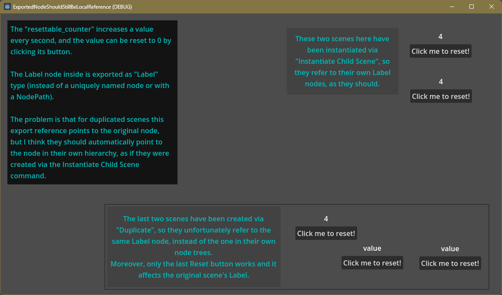

Demonstrating a strange behavior in Godot v4.1.1.stable.mono.official [bd6af8e0e], where an exported node reference points to a wrong node when the scene is duplicated.

I have created a simple scene that uses a Label, exported as a Label type (instead of using a NodePath, or a relative or a unique node name with `get_node`).

When this scene is instantiated in the editor via the "Instantiate a Child Scene" command, each scene properly refers to their own Label.

However, if I use the "Duplicate" command in the editor, all the duplicated scene instances will point to the Label in the original scene. I don't think this behavior is intended or desired. I think the Duplicate command should create instances where the exported node is referenced locally, as if the scene were instantiated via the "Instantiate a Child Scene" command.

